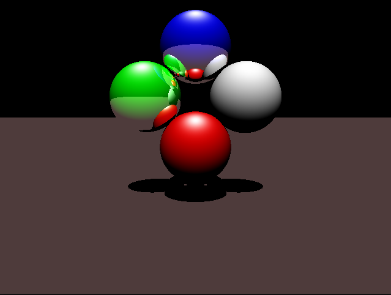

# Multithreaded-RayTracer

This Ray Tracer was made in 3rd year of university, exporling graphics programming with ray tracing as well as multithreading to process the simple scene using a CPUs multiple cores at the same time with features such as reflections and shadows.

